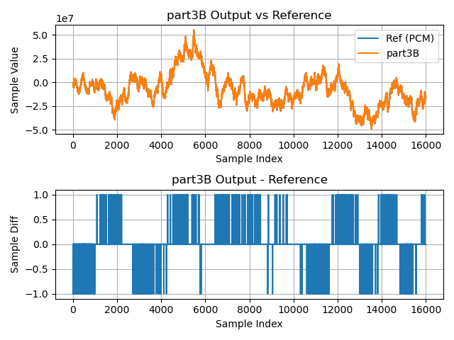

[Prev](part3A.md) | [Home](intro.md) | [Next](part3C.md)

# Part 3B

Like [**Part 3A**](part3A.md), **Part 3B** implements the FIR filter 
using block floating-point arithmetic.

In **Part 3A** we implemented the block floating-point FIR filter using plain C.
We had to manage exponents and headroom ourselves, as well as the logic for
computing the inner product, which was similar to that in [**Part
2A**](part2A.md).

In **Part 3B** we will use the same data structures as **Part 3A** to represent
the BFP vectors, but we will replace our C code which calculates and manages
headroom and exponents with calls to functions from `lib_xcore_maths's low-level
vector API to do some of this work for us. We also replace our `for` loop where
the inner product is computed with a call to `vect_s32_dot()`, which we
encountered in [**Part 2C**](part2C.md).

This will also mean using the VPU to do the bulk of the work, rather than the
scalar unit.

### From `lib_xcore_math`

This stage makes use of the following operations from `lib_xcore_math`:

* [`vect_s32_headroom()`](TODO)
* [`vect_s32_dot()`](TODO)
* [`vect_s32_dot_prepare()`](TODO)
* [`vect_s32_shr()`](TODO)

## Implementation

In **Part 3B**, `filter_task()`, `rx_frame()`, and `tx_frame()` are all
identical to those in **Part 3A**, and are omitted here.

### **Part 3B** `calc_headroom()` Implementation

From [`part3B.c`](TODO):
```c
// Compute headroom of int32 vector.
static inline
headroom_t calc_headroom(
    const int32_t vec[],
    const unsigned length)
{
  return vect_s32_headroom(vec, length);
}
```

Here we see that in **Part 3B**, `calc_headroom()` is just a wrapper around
`vect_s32_headroom()`. This is not only much simpler, but also much, much
faster. `vect_s32_headroom()` still has to iterate over the entire `vec[]` array
to determine the headroom, but unlike our C implementation,
`vect_s32_headroom()` uses the VPU's dedicated headroom hardware to deal with 8
elements every 3 instructions.

A quick examination of **Part 3A**'s `calc_headroom()` disassembly indicates
that it handles 1 element about every 10 instructions.

### **Part 3B** `filter_frame()` Implementation

From [`part3B.c`](TODO):
```c
// Calculate entire output frame
void filter_frame(
    int32_t frame_out[FRAME_SIZE],
    exponent_t* frame_out_exp,
    headroom_t* frame_out_hr,
    const int32_t history_in[HISTORY_SIZE],
    const exponent_t history_in_exp,
    const headroom_t history_in_hr)
{
  // First, determine output exponent and required shifts.
  right_shift_t b_shr, c_shr;
  vect_s32_dot_prepare(frame_out_exp, &b_shr, &c_shr, 
                       history_in_exp, filter_bfp.exp,
                       history_in_hr, filter_bfp.hr, 
                       TAP_COUNT);
  // vect_s32_dot_prepare() ensures the result doesn't overflow the 40-bit VPU
  // accumulators, but we need it in a 32-bit value.
  right_shift_t s_shr = 8;
  *frame_out_exp += s_shr;

  // Compute FRAME_SIZE output samples.
  for(int s = 0; s < FRAME_SIZE; s++){
    timer_start(TIMING_SAMPLE);
    int64_t samp = filter_sample(&history_in[FRAME_SIZE-s-1], 
                                 b_shr, c_shr);
    frame_out[s] = sat32(ashr64(samp, s_shr));
    timer_stop(TIMING_SAMPLE);
  }

  //Finally, calculate the headroom of the output frame.
  *frame_out_hr = calc_headroom(frame_out, FRAME_SIZE);
}
```

In **Part 3B**, `filter_frame()` is a little different than **Part 3A**. **Part
3B** makes use of `vect_s32_dot_prepare()` from `lib_xcore_math` to help
determine an output exponent and shift values for us. We saw
`vect_s32_dot_prepare()` in [**Part 3**](part3.md#_prepare-functions-in-lib_xcore_math).

Briefly, `vect_s32_dot_prepare()` takes the exponents and headroom of the two
input vectors as well as the length of the vectors and uses those to determine
the output exponent, and two `right_shift_t` values that need to be passed to
`vect_s32_dot()`.

There is a complication here. `vect_s32_dot()` (and `filter_sample()`) return
`int64_t` values. (This is typical for 32-bit vector functions in
`lib_xcore_math` which return scalars, such as `vect_s32_dot()`,
`vect_s32_energy()` and `vect_s32_sum()`). Because the VPU's accumulators in
32-bit more are 40 bits, we know that to be safe we need to shift the result an
extra 8 bits.

So, we add 8 to the exponent given by vect_s32_dot_prepare() and shift the
result of `filter_sample()` by 8 bits.

> **Note**: Instead of shifting the output of `filter_sample()` by 8 bits, we
> could have instead added a total of 8 between the `b_shr` and `c_shr` output
> by `vect_s32_dot_prepare()`, however because those shifts are applied prior to
> multiplication, adding to them may result in unnecessary loss of precision.


### **Part 3B** `filter_sample()` Implementation

From [`part3B.c`](TODO):
```c
// Apply the filter to produce a single output sample.
int64_t filter_sample(
    const int32_t sample_history[TAP_COUNT],
    const right_shift_t b_shr,
    const right_shift_t c_shr)
{
  // Compute the inner product's mantissa using the given shift parameters.
  return vect_s32_dot(&sample_history[0], 
                      &filter_bfp.data[0], TAP_COUNT,
                      b_shr, c_shr);
}
```

`filter_sample()` takes the sample history and the shift parameters generated by
`vect_s32_dot_prepare()` and calls `vect_s32_dot()` much like in **Part 2C**,
except now the 64-bit result is returned.

### **Part 3B** `rx_and_merge_frame()` Implementation

From [`part3B.c`](TODO):
```c
// Accept a frame of new audio data and merge it into sample_history
static inline 
void rx_and_merge_frame(
    int32_t sample_history[HISTORY_SIZE],
    exponent_t* sample_history_exp,
    headroom_t* sample_history_hr,
    const chanend_t c_audio)
{
  // BFP vector into which new frame will be placed.
  struct {
    int32_t data[FRAME_SIZE];   // Sample data
    exponent_t exp;             // Exponent
    headroom_t hr;              // Headroom
  } frame_in = {{0},0,0};

  // Accept a new input frame
  rx_frame(frame_in.data, 
           &frame_in.exp, 
           &frame_in.hr, 
           c_audio);

  // Rescale BFP vectors if needed so they can be merged
  const exponent_t min_frame_in_exp = frame_in.exp - frame_in.hr;
  const exponent_t min_history_exp = *sample_history_exp - *sample_history_hr;
  const exponent_t new_exp = MAX(min_frame_in_exp, min_history_exp);

  const right_shift_t hist_shr = new_exp - *sample_history_exp;
  const right_shift_t frame_in_shr = new_exp - frame_in.exp;

  if(hist_shr) {
    vect_s32_shr(&sample_history[0], 
                 &sample_history[0], 
                 HISTORY_SIZE,
                 hist_shr);
    *sample_history_exp = new_exp;
  }

  if(frame_in_shr){
    vect_s32_shr(&frame_in.data[0],
                 &frame_in.data[0],
                 FRAME_SIZE,
                 frame_in_shr);
  }
  
  // Now we can merge the new frame in (reversing order)
  for(int k = 0; k < FRAME_SIZE; k++)
    sample_history[FRAME_SIZE-k-1] = frame_in.data[k];

  // And just ensure the headroom is correct
  *sample_history_hr = calc_headroom(sample_history, HISTORY_SIZE);
}
```

The only difference between `rx_and_merge_frame()` between **Part 3A** and
**Part 3B** is how the samples are actually shifted. Instead of looping over
samples one by one, **Part 3B** calls `vect_s32_shr()`, which uses the VPU to
apply a signed, arithmetic, saturating right-shift.


## Results

### Timing

| Timing Type       | Measured Timing
|-------------------|-----------------------
| Per Filter Tap    | 15.14 ns   
| Per Output Sample | 15498.91 ns
| Per Frame         | 4054082.75 ns

### Output Waveform

