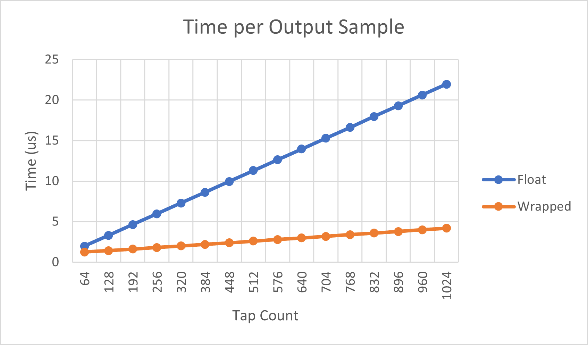
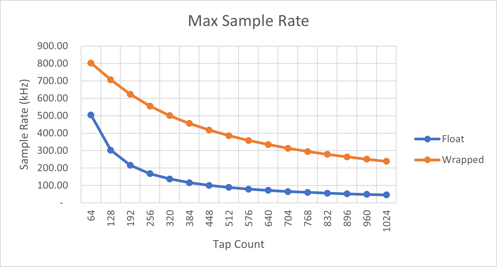
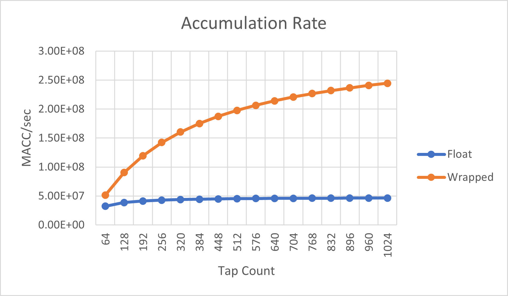
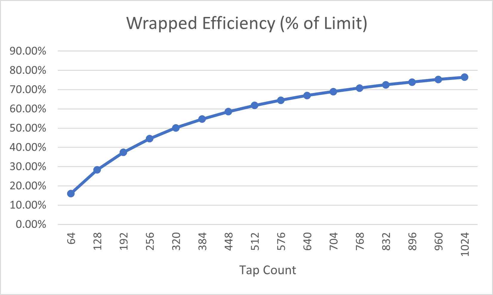
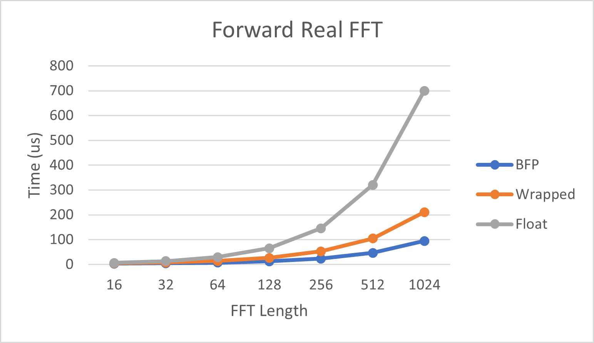
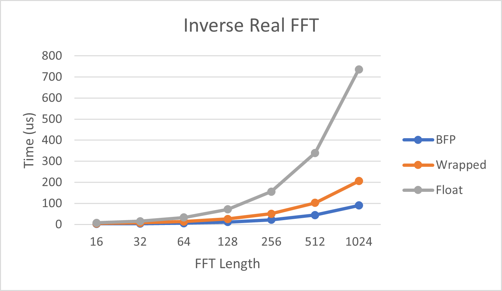
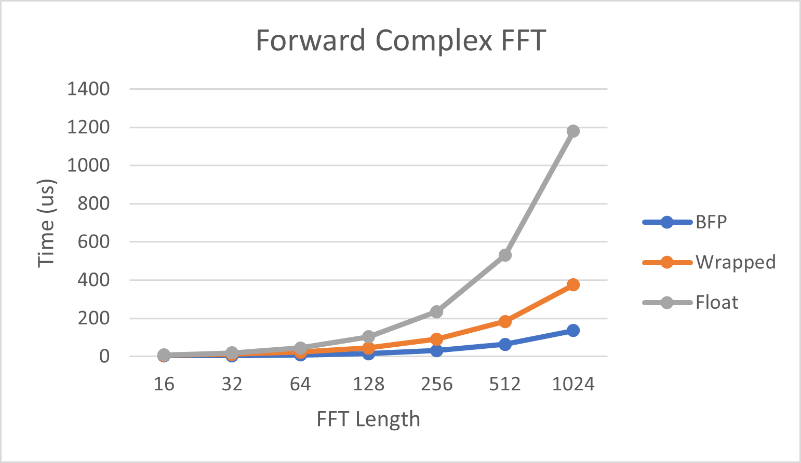
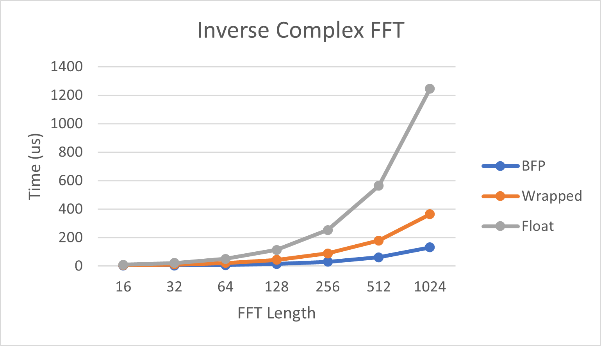

# Appendix A

This appendix adds additional performance information for particular scenarios
of interest. These cases do not fit cleanly into the main body of the tutorial,
but the information is likely to be useful. These are not discussed in any depth
from a conceptual perspective. The code which implements them will be referred
to, but examination of that code is left to the reader.

The applications used to measure this performance are small and depend only on
`lib_xcore_math` (they do not share code with parts 1 through 4).

## Floating-Point FIR Filter, an Alternative Approach

In [**Part 1B**](../part1B.md) and [**Part 1C**](../part1C.md) we looked at a
fully floating-point implementation of the FIR filter being implemented. This
section directly compares the performance of an optimized fully floating-point
implementation to using `lib_xcore_math`'s 32-bit digital filter API with a
`float` wrapper which converts from `float` to fixed-point, filters, and then
converts the output back to `float`. (That this is the reverse of what
**Part 1C** did).

```{note} 
The "wrapping" approach used here still operates on blocks of input and output 
samples, as that enables us to perform the conversion more efficiently than 
converting individual samples.
```

Because the code path for the floating-point logic involved is sensitive to the
data values, random filter weights and input data were used.

The filters created in this application have orders ranging from 64 taps to 1024
taps.

### Results

The following sections present the measured results from running the
application. In all cases the device was running with a core clock rate of 600
MHz.

```{note} 
The data in the plots below are from timing measured using the Xcore's built-in
100 MHz reference clock. The measurements depend upon small details including,
among other things, code placement within memory and compiler optimization 
levels. In a real world application the performance may vary somewhat.

In particular, I've found that relatively small changes to the 
`filter_wrapped()` function in `filter_wrapped.c` can make a several percent 
difference in performance.
```

#### Sample Processing Performance



The plot above compares the per-output-sample processing time (in microseconds)
for each implementation as a function of the tap count. The "Float" series is
the pure floating-point implementation, and "Wrapped" is the fixed-point FIR
filter using a floating-point wrapper. As expected, the time cost for both
implementations increases linearly with respect to the tap count. The cost per
filter tap increases significantly faster using the pure floating-point
implementation.

Given the time to compute each output sample, we can take the inverse to get the
maximum sample rate each implementation can handle in a real-time system.



```{note} 
The maximum sample rate described here is assuming a single thread is used to do 
nothing but filtering of a real-time input stream. It is still possible to 
handle even higher sample rates in real time by using multiple hardware cores or 
tiles.
```

Naturally, the maximum sample rate decreases as the tap count increases.
However, because the wrapped implementation becomes relatively _more_ efficient
with higher tap counts, with large filters it can handle much greater sample
rates than the float implementation.

The following plot, which shows the ratio of "Float" sample time to "Wrapped"
sample time, makes this comparison even more explicit.


#### Accumulation Rates

The following plot compares the accumulation rates for the floating-point and
wrapped implementations. Here the "accumulation rate" is defined as the number
of (useful) equivalent scalar multiply-acculate operations which happen per
second. "Useful" here includes only those multiply-accumulates which are 
strictly necessary to compute output samples. For example, a 128-tap FIR filter
has exactly 128 "useful" multiply-accumulates per output sample.



Here we a major difference in performance between the Float and Wrapped
implementations. Each implmenentation uses library functions from
`lib_xcore_math` with inner loops optimized for large filters. But each
implementation also has some amount of fixed overhead outside of the optimized
loop. 

The Float filter implementation has relatively little overhead, which is why its
accumulation rate changes from about 32.3 MMACCs/sec with 64 taps to only about
46.7 MMACCs/sec with 1024 taps. The Wrapped implementation, on the other hand,
which can handle about 51.4 MMACCs/sec with 64 taps, soars to around 245
MMACCs/sec with 1024 taps. This is why the Wrapped implementation is so much
more efficient with larger filters.



This final plot shows how the efficiency of the Wrapped implementation depends
upon the tap count. The efficiency here is the accumulation rate divided by the
accumulation rate which is asymptotically approached as the tap count increases 
towards infinity. 

The theoretical limit of the accumulation rate is that which would be achieved
if the filter spent 100% of its time in the inner loop. As such, it is a
function of several factors: $F$, the core CPU clock frequency, $I$ the number
of inner loop instructions (or instruction bundles in dual-issue mode), and $M$,
the number of MACCs performed in each loop iteration.

$$
\begin{aligned}
    F &= 600 \text{ MHz} \\
    M &= 8 \text{ MACC} \\
    I &= 3 \text{ Inst} \\
    r^* &= \frac{F}{5 \text{ Inst}^{-1}} \cdot \frac{M}{I} \\
        &= \frac{600 \text{ MHz}}{5 \text{ Inst}^{-1}} \cdot \frac{8 \text{ MACC}}{3 \text{ Inst}} \\
        &= 120 \text{ (MInst/s)} \cdot \frac{8}{3} \text{ (MACC/Inst)} \\
        &= 3.2 \cdot 10^8 \text{  MACC/s}
\end{aligned}
$$

The division by $5$ is because the core pipeline is 5 stages long, and so a 
single hardware thread can issue instructions only once every 5 core clock 
cycles.

## Fast Fourier Transform

This section compares three versions of various fast Fourier transform (FFT)
operations. One scheme is a pure floating-point. Another, similar to the
previous section, uses a `float` API, but internally converts the floating-point
vector to BFP, performs the FFT in BFP, and then converts the resulting BFP
vector back to floating-point. That is referred to as the "wrapped"
implementation, because it is BFP "wrapped" in a floating-point API. The final
version is a plain BFP implementation (with a BFP API).

For each scheme, the operations measured, with varying input sequence lengths,
are: forward real FFT, inverse real FFT, forward complex FFT, inverse complex
FFT. Each is measured using inputs of lengths $16, 32, 64, 128, 256, 512,$ and
$1024$.

### Results

All results were obtained running on a single hardware thread with a core clock
rate of 600MHz.

#### Real FFT

The following plots show the time required to perform forward real FFTs. A real
FFT is the FFT of a single, real-valued signal. The properties of the FFT make
it possible to compute the $2N$-point FFT of a real-valued signal using an
$N$-point complex FFT, making it much faster.



```{eval-rst}
+--------+----------+-----------+----------+  
| Length |  BFP     | Wrapped   | Float    | 
+========+==========+===========+==========+
| 16     | 2.28 us  | 4.61 us   | 6.22 us  | 
+--------+----------+-----------+----------+ 
| 32     | 4.29 us  | 7.89 us   | 13.67 us | 
+--------+----------+-----------+----------+ 
| 64     | 6.84 us  | 14.06 us  | 30.14 us | 
+--------+----------+-----------+----------+ 
| 128    | 12.24 us | 26.73 us  | 66.74 us | 
+--------+----------+-----------+----------+ 
| 256    | 23.31 us | 52.34 us  | 147.1 us | 
+--------+----------+-----------+----------+ 
| 512    | 46.58 us | 104.77 us | 323.1 us | 
+--------+----------+-----------+----------+ 
| 1024   | 94.64 us | 210.89 us | 705.0 us | 
+--------+----------+-----------+----------+ 
```


#### Real iFFT

The following plots show the time required to perform inverse real FFTs. A real
FFT is the FFT of a single, real-valued signal. The properties of the FFT make
it possible to compute the inverse FFT of a real-valued $2N$-point signal using
an $N$-point complex inverse FFT, making it much faster.





```{eval-rst}
+--------+----------+-----------+-----------+ 
| Length |  BFP     | Wrapped   | Float     | 
+========+==========+===========+===========+ 
| 16     | 2.64 us  | 4.61 us   | 7.47 us   | 
+--------+----------+-----------+-----------+ 
| 32     | 4.03 us  | 7.81 us   | 15.46 us  | 
+--------+----------+-----------+-----------+ 
| 64     | 6.44 us  | 13.88 us  | 32.97 us  | 
+--------+----------+-----------+-----------+ 
| 128    | 11.57 us | 26.23 us  | 71.58 us  | 
+--------+----------+-----------+-----------+ 
| 256    | 22.11 us | 51.12 us  | 155.85 us | 
+--------+----------+-----------+-----------+ 
| 512    | 44.31 us | 102.39 us | 339.33 us | 
+--------+----------+-----------+-----------+ 
| 1024   | 90.24 us | 205.80 us | 735.60 us | 
+--------+----------+-----------+-----------+ 
```


#### Complex FFT

The following plot shows the time required to perform a forward complex FFT.




```{eval-rst}
+--------+-----------+-----------+------------+
| Length |  BFP      | Wrapped   | Float      |
+========+===========+===========+============+
| 16     | 2.34 us   | 6.23 us   | 8.17 us    |
+--------+-----------+-----------+------------+
| 32     | 3.98 us   | 11.61 us  | 19.17 us   |
+--------+-----------+-----------+------------+
| 64     | 7.54 us   | 22.65 us  | 44.83 us   |
+--------+-----------+-----------+------------+
| 128    | 14.94 us  | 44.97 us  | 103.37 us  |
+--------+-----------+-----------+------------+
| 256    | 30.87 us  | 90.73 us  | 235.63 us  |
+--------+-----------+-----------+------------+
| 512    | 64.28 us  | 183.79 us | 530.03 us  |
+--------+-----------+-----------+------------+
| 1024   | 135.27 us | 374.56 us | 1179.90 us |
+--------+-----------+-----------+------------+
```


#### Complex iFFT

The following plot shows the time required to perform an inverse complex FFT.




```{eval-rst}
+--------+-----------+-----------+------------+
| Length |  BFP      | Wrapped   | Float      |
+========+===========+===========+============+
| 16     | 2.24 us   | 6.12 us   | 9.90 us    |
+--------+-----------+-----------+------------+
| 32     | 3.81 us   | 11.38 us  | 21.87 us   |
+--------+-----------+-----------+------------+
| 64     | 7.43 us   | 22.10 us  | 49.41 us   |
+--------+-----------+-----------+------------+
| 128    | 14.54 us  | 43.80 us  | 111.56 us  |
+--------+-----------+-----------+------------+
| 256    | 30.36 us  | 88.48 us  | 250.77 us  |
+--------+-----------+-----------+------------+
| 512    | 61.55 us  | 178.89 us | 558.51 us  |
+--------+-----------+-----------+------------+
| 1024   | 130.98 us | 364.71 us | 1233.98 us |
+--------+-----------+-----------+------------+
```

