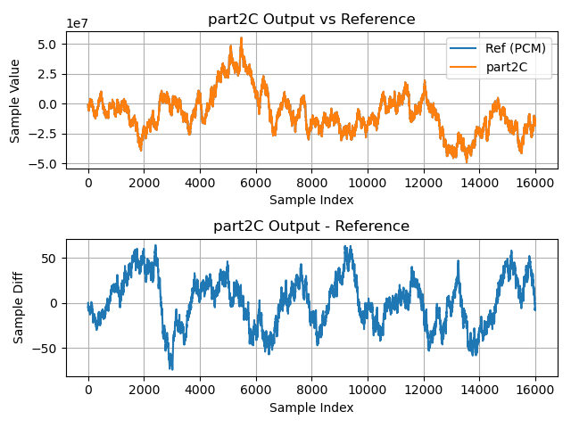

# Part 2C: Using the VPU to accelrate things

Like [**Part 2B**](part2B.md), **Part 2C** implements the FIR filter
using fixed-point arithmetic. 

In **Part 2B**, we called `int32_dot()` to compute the inner product for us.
While `int32_dot()` was much faster than the compiler-generated inner product we
wrote in C (in [**Part 2A**](part2A.md)), `int32_dot()` still only uses the
xcore device's scalar arithmetic unit.

**Part 2C** replaces `int32_dot()` with a call to
[`vect_s32_dot()`](https://github.com/xmos/lib_xcore_math/blob/v2.1.1/lib_xcore_math/api/xmath/vect/vect_s32.h#L399-L480),
one of the library functions from
[`lib_xcore_math`](https://github.com/xmos/lib_xcore_math)'s lower-level vector
API. Unlike `int32_dot()`, `vect_s32_dot()` does use the VPU to do its work.

We'll see that using the VPU gives us a significant speed-up.

## From `lib_xcore_math`

This stage makes use of the following operations from `lib_xcore_math`:

* [`vect_s32_dot()`](https://github.com/xmos/lib_xcore_math/blob/v2.1.1/lib_xcore_math/api/xmath/vect/vect_s32.h#L399-L480)
* [`vect_s32_mul()`](https://github.com/xmos/lib_xcore_math/blob/v2.1.1/lib_xcore_math/api/xmath/vect/vect_s32.h#L828-L880)

## Implementation

In this part, `filter_task()`, `rx_frame()` and `tx_frame()` are identical to
those in **Part 2A** and **Part 2B**.

---

```{literalinclude} ../../src/part2C/part2C.c
---
language: C
start-after: +filter_sample
end-before: -filter_sample
---
```

`vect_s32_dot()` differs from `int32_dot()` in an important way that we need to
account for.

> ```c
> C_API
> int64_t vect_s32_dot(
>     const int32_t b[],
>     const int32_t c[],
>     const unsigned length,
>     const right_shift_t b_shr,
>     const right_shift_t c_shr);
> ```

Where the output of `int32_dot()` was the direct inner product of two `int32_t`
vectors, `vect_s32_dot()` has some additional manipulation, some forced by
hardware, and some needed for block floating-point arithmetic.

$$
    a \gets \sum_{k=0}^{\mathtt{length}-1}{\left(
        \frac{\mathtt{b}[k]}{2^{\mathtt{b\_shr}}}
        \cdot
        \frac{\mathtt{c}[k]}{2^{\mathtt{c\_shr}}}
        \cdot 2^{-30}
    \right)}
$$

```{note} 
In the `lib_xcore_math` documentation, the _output_ of an operation is typically
given the variable $a$, whereas $b$ and $c$ are usually used for the inputs to
the operation. The $a$ above should be thought of as the return value. Some
library functions, such as `vect_s32_mul() output vectors, and so must output it
through an argument rather than returning it. $a$ is still considered the output
in those cases.
```

The XS3 VPU always applies a 30-bit right-shift to the product of 32-bit
multiplies, which introduces the $2^{-30}$ factor. The `b_shr` and `c_shr`
parameters are signed, arithmetic right-shifts which are applied to individual
elements of `b[]` and `c[]` respectively _prior_ to multiplication. 

To see why this is necessary, consider the following hypothetical case:

```C
int32_t b[] = {20};
int32_t c[] = {15};
right_shift_t b_shr = 0;
right_shift_t c_shr = 0;
int64_t a = vect_s32_dot(b, c, 1, b_shr, c_shr);
```

What will `a` be?

$$
\begin{aligned}
    a &= \sum_{k=0}^{\mathtt{length}-1}{\left(
        \frac{\mathtt{b}[k]}{2^{\mathtt{b\_shr}}}
        \cdot
        \frac{\mathtt{c}[k]}{2^{\mathtt{c\_shr}}}
        \cdot 2^{-30}
    \right)} \\
    &= \frac{\mathtt{b}[0]}{2^{0}}
        \cdot
        \frac{\mathtt{c}[0]}{2^{0}}
        \cdot 2^{-30} \\
    &= 20 \cdot 15 \cdot 2^{-30} \\
    &= 300 \gg 30 \\
    &= 0
\end{aligned}
$$

That isn't great if we were expecting `a` to get `300`. Now consider:

```C
int32_t b[] = {20};
int32_t c[] = {15};
right_shift_t b_shr = -14;
right_shift_t c_shr = -16;
int64_t a = vect_s32_dot(b, c, 1, b_shr, c_shr);
```

Now what will `a` be?

$$
\begin{aligned}
    a &= \sum_{k=0}^{\mathtt{length}-1}{\left(
        \frac{\mathtt{b}[k]}{2^{\mathtt{b\_shr}}}
        \cdot
        \frac{\mathtt{c}[k]}{2^{\mathtt{c\_shr}}}
        \cdot 2^{-30}
    \right)} \\
    &= \frac{\mathtt{b}[0]}{2^{-14}}
        \cdot
        \frac{\mathtt{c}[0]}{2^{-16}}
        \cdot 2^{-30} \\
    &= (20 \cdot 2^{14}) \cdot (15 \cdot 2^{16}) \cdot 2^{-30} \\
    &= 327680 \cdot 983040 \cdot 2^{-30} \\
    &= 322122547200 \gg 30 \\
    &= 300
\end{aligned}
$$

This time we used `b_shr` and `c_shr` to counter-act the 30-bit shift. The
particular values chosen for `b_shr` and `c_shr` weren't important. The
requirements were that `b_shr + c_shr == -30`, and that where `b_shr` or `c_shr`
is negative, it doesn't exceed the headroom of `b[]` or `c[]` respectively.


---

Getting back to our filter, let's consider how we have to correct our arithmetic to account for the 30-bit right-shift.

In [**Part 2A**](part2A.md) we saw that when we computed the direct product of
the input samples and filter coefficients the accumulator exponent was just the
sum of the input exponent and the coefficient exponent. But now, instead of computing the accumulator as

$$
\mathtt{P} =  \sum_{n=0}^{N-1} {\mathtt{x}[k-n] \cdot \mathtt{b}[n]}
$$

we must compute it as (with `b_shr = c_shr = 0` in our call to `vect_s32_dot()`)

$$
\begin{aligned}
\mathtt{Q} 
&= \sum_{n=0}^{N-1} \left( \mathtt{x}[k-n] \cdot \mathtt{b}[n] \cdot 2^{-30} \right) \\
&= 2^{-30}\,\sum_{n=0}^{N-1} \mathtt{x}[k-n] \cdot \mathtt{b}[n] \\
&= 2^{-30}\cdot \mathtt{P}
\end{aligned}
$$

where $\mathtt{Q}$ is the new accumulator variable for **Part 2C**.

Let's figure out what we have to do to get the correct result. Starting with our
(simplified) filter equation (see [**Part 2A**](part2A.md)):

$$
\begin{aligned}
\mathtt{y}[k] \cdot 2^{\hat{y}} 
  &= 2^{\hat{x}+\hat{b}} 
  \sum_{n=0}^{N-1} {\mathtt{x}[k-n] \cdot \mathtt{b}[n]}   \\ 
  &= 2^{\hat{x}+\hat{b}} \left(2^{30}\cdot 2^{-30}\right) 
  \sum_{n=0}^{N-1} {\mathtt{x}[k-n] \cdot \mathtt{b}[n]}   \\ 
  &= 2^{\hat{x}+\hat{b}+30} \cdot \left (2^{-30}
  \sum_{n=0}^{N-1} {\mathtt{x}[k-n] \cdot \mathtt{b}[n]} \right)   \\ 
  &= 2^{\hat{x}+\hat{b}+30} \cdot \mathtt{Q}  \\ 
\end{aligned}
$$

This tells us that our accumulator exponent `acc_exp` $=\hat{Q} = \hat{x}+\hat{b}+30 = \hat{P}+30$.  Knowing that, we compute our output shift in the same way we did in **Part 2A** -- the output exponent we _want_ minus the exponent we _have_:

> ```c
>   const exponent_t acc_exp = input_exp + coef_exp + 30;
>   const right_shift_t acc_shr = output_exp - acc_exp;
> ```

For full details about `vect_s32_dot()` see `lib_xcore_math`'s [documentation](https://github.com/xmos/lib_xcore_math/blob/v2.1.1/lib_xcore_math/api/xmath/vect/vect_s32.h#L399-L480).

## Results

The inner loop in `vect_s32_dot()`'s implementation is 11 instructions long. The
inner loop in `int32_dot()`'s implementation was only 4 instructions, so why is
`vect_s32_dot()` so much faster?

The XS3 VPU's vector registers are each 8 words long. The `VLMACCR` instruction
used by `vect_s32_dot()` loads a vector (8 elements) from memory and performs 8
multiplications (and additions) all at once.

So, while in `int32_dot()` we were performing a single multiplication and
addition for each iteration of the loop, in `vect_s32_dot()` we perform 8.
Naively, then, we should expect a speed-up of about

$$
  \frac{8\text{ elements}}{11\text{ instructions}} \cdot \left(\frac{1 \text{ element}}{4\text{ instructions}}\right)^{-1} = \frac{32}{11}\approx 2.91
$$

In practice, due to other overhead, we see a speed-up here of about $2.4$
(computing output samples).

### Timing

| Timing Type       | Measured Timing
|-------------------|-----------------------
| Per Filter Tap    | 13.94 ns
| Per Output Sample | 14274.91 ns
| Per Frame         | 3720900.00 ns

### Output Waveform

