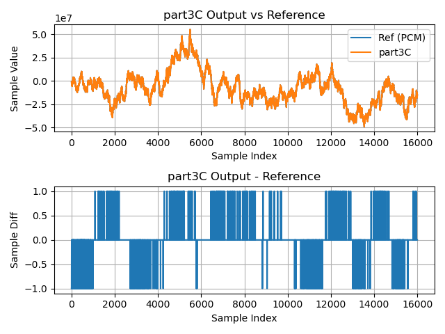

# Part 3C

In **Part 3C** we finally use `lib_xcore_math`'s block floating-point (BFP) API.

Here we don't expect any particularly noticeable performance boost relative to
[**Part 3B**](part3B.md)'s implementation. At bottom, both stages ultimately use
the same function (`vect_s32_dot()`) to do the bulk of the work computing the
filter output. Instead, in this stage we will see how using the `lib_xcore_math`
BFP API can simplify our code by doing much of the book-keeping for us.

That being said, this is not the ideal application of BFP arithmetic,
particularly because of our application's requirement for fixed-point output
samples.

## From `lib_xcore_math`

This page references the following operations from `lib_xcore_math`:

* [`bfp_s32_init()`](https://github.com/xmos/lib_xcore_math/blob/v2.1.1/lib_xcore_math/api/xmath/bfp/bfp_s32.h#L17-L45)
* [`bfp_s32_headroom()`](https://github.com/xmos/lib_xcore_math/blob/v2.1.1/lib_xcore_math/api/xmath/vect/vect_s32.h#L554-L591)
* [`bfp_s32_dot()`](https://github.com/xmos/lib_xcore_math/blob/v2.1.1/lib_xcore_math/api/xmath/bfp/bfp_s32.h#L498-L522)
* [`bfp_s32_use_exponent()`](https://github.com/xmos/lib_xcore_math/blob/v2.1.1/lib_xcore_math/api/xmath/bfp/bfp_s32.h#L134-L187)
* [`vect_s32_dot_prepare()`](https://github.com/xmos/lib_xcore_math/blob/v2.1.1/lib_xcore_math/api/xmath/vect/vect_s32_prepare.h#L182-L252)
* [`bfp_s32_convolve_valid()`](https://github.com/xmos/lib_xcore_math/blob/v2.1.1/lib_xcore_math/api/xmath/bfp/bfp_s32.h#L953-L996)
* [`bfp_s32_convolve_same()`](https://github.com/xmos/lib_xcore_math/blob/v2.1.1/lib_xcore_math/api/xmath/bfp/bfp_s32.h#L999-L1052)


## Implementation

---

```{literalinclude} ../../src/part3C/part3C.c
---
language: C
start-after: +calc_headroom
end-before: -calc_headroom
---
```

In this stage `calc_headroom()` just calls the `bfp_s32_headroom()` operation on
the provided BFP vector. `bfp_s32_headroom()` _both_ updates the `hr` field of
the `bfp_s32_t` object, and returns that headroom. In this case
`calc_headroom()` also returns that headroom, though in **Part 3C** the returned
value is not needed and not used.

---

```{literalinclude} ../../src/part3C/part3C.c
---
language: C
start-after: +filter_task
end-before: -filter_task
---
```

In **Part 3C** `filter_task()` is quite similar to that in the previous two
stages. This time we have a few calls at the beginning to initialize some of the
BFP vectors. Notably, this time we must intialize `bfp_filter_coef`, the BFP
vector representing the filter coefficients, which we did not need to do in
previous stages.

`bfp_s32_init()` is used to initialize each of the BFP vectors, associating a
`bfp_s32_t` object with an exponent, length, and most importantly, the buffer
used to store the vector's elements. The final argument to `bfp_s32_init()` is a
boolean indicating whether the vector's headroom should be calculated during
initialization.

Calculating the headroom involves iterating over the array's data, which should
be avoided when unnecessary. In particular, it usually does not make sense to
calculate headroom if the element buffer hasn't already been populated with
initial values.

---

```{literalinclude} ../../src/part3C/part3C.c
---
language: C
start-after: +filter_frame
end-before: -filter_frame
---
```

`filter_frame()` in **Part 3C** is tricky. At bottom the issue here is that
`lib_xcore_math`'s BFP API doesn't provide any convolution operations suitable
for this scenario. There _are_ a pair of 32-bit BFP convolution functions,
`bfp_s32_convolve_valid()` and `bfp_s32_convolve_same()`,
however these are optimized for (and only support) small convolution kernels of
`1`, `3`, `5` or `7` elements.

In fact, BFP is probably _not_ the right approach for implementing an FIR filter
using `lib_xcore_math` (we'll see better approaches in [**Part 4B**](part4B.md)
and [**Part 4C**](part4C.md)).

But in keeping with the spirit of this tutorial, this stage attempt to implement
the filter using the BFP API as best possible.

`filter_frame()` first initializes a new BFP vector called `history_view`.
However, `history_view` does not get its own data buffer. instead it points to
an address somewhere within `sample_history`'s data buffer. Additionally, where
`sample_history`'s `length` is `HISTORY_SIZE` (1280), the length of
`history_view` is `TAP_COUNT` (1024). `history_view` uses the same exponent and
headroom as `sample_history`. Taken together, this makes `history_view`
something like a window onto some portion of the `sample_history` vector (hence
history _"view"_).

For each output sample computed by `filter_sample()`, `history_view`'s `data`
pointer 'slides' back 1 element towards the start of the `sample_history`
vector. Recall that in all previous stages, we actually did something similar --
each call to `filter_sample()` in previous stages passed a pointer to a
different location of the history vector.  This is basically doing the same
thing, in a way that corrects for the fact that **Part 3C**'s `filter_sample()`
needs a BFP vector _the same length as `bfp_filter_coef`_.

The other tricky piece to `filter_frame()` in **Part 3C** is the determination
of the output exponent.  Here we _could have_ just called
`vect_s32_dot_prepare()` to determine the output exponent. For the sake of
sticking with BFP functions it takes a different approach, which takes advantage
of our knowledge of the situation.

In particular, we know that under the surface `bfp_s32_dot()` is itself calling
`vect_s32_dot_prepare()`, and that because the exponent and headroom of both
`history_view` and `bfp_filter_coef` will be the same with each call (for a
given frame), we know that the output exponent will be the same each time. So
instead of calling `vect_s32_dot_prepare()` ourselves, we base the output
exponent on the first exponent returned by `filter_sample()`.

However, `filter_sample()` returns a `float_s64_t`, which, because of how
`vect_s32_dot()` is implemented, won't take up more than 40 bits of the 64-bit
mantissa. We need the result to fit in 32 bits, so we add 8 to the output
exponent, and use `float_s64_to_fixed()` to shift samples before placing them in
`frame_out`.

```{note} 
To be clear, if you find yourself doing these things in an actual application,
you are probably better off reverting to the lower-level Vector API. That
doesn't mean getting rid of all `bfp_s32_t` in your application or application
component; it just means that within the function that implements your
operation, you may want to destructure the `bfp_s32_t` and operate directly on
its fields using the Vector API.
 
Additionally, if you're trying to use the BFP or Vector API to implement a
time-domain FIR or IIR filter, you may want to look at the [Digital Filter
API](https://github.com/xmos/lib_xcore_math/blob/v2.1.1/lib_xcore_math/api/xmath/filter.h)
instead.
```


---


```{literalinclude} ../../src/part3C/part3C.c
---
language: C
start-after: +filter_sample
end-before: -filter_sample
---
```

`filter_sample()` in **Part 3C** is quite simple. It just calls `bfp_s32_dot()`
to compute the inner product of the provided `sample_history` BFP vector and the
filter coefficient BFP vector. 

In this stage, the filter coefficients are represented by `bfp_filter_coef` of
type `bfp_s32_t`. This vector uses the same underlying coefficient array as the
previous two stages (from `filter_coef_q2_30.c`), but they are wrapped in a BFP
vector which tracks their length, exponent and headroom for the user. BFP
vectors representd by a `bfp_s32_t` need to be initialized before they can be
used. In this case `bfp_filter_coef` is initialized in `filter_task()` prior to
entering the main thread loop.

---


```{literalinclude} ../../src/part3C/part3C.c
---
language: C
start-after: +tx_frame
end-before: -tx_frame
---
```

In **Part 3C** `tx_frame()` is similar to that in **Part 3B**.  Its job is to
ensure output samples are using an exponent of `-31`, and then send them to the
`wav_io` thread.

In **Part 3B** this was accomplished by explicitly calculating a shift to be
applied to each sample value and then applying them before putting the output
sample into the channel. **Part 3C**, however, accomplishes this just by calling `bfp_s32_use_exponent()`.

`bfp_s32_use_exponent()` coerces a BFP vector to use a particular exponent, shifting the elements as necessary to accomplish that. It is an easy way to move from a block floating-point domain (this stage's filter) into a fixed-point domain (the `wav_io` thread).

---


```{literalinclude} ../../src/part3C/part3C.c
---
language: C
start-after: +rx_frame
end-before: -rx_frame
---
```

`rx_frame()` is almost identical to that in **Part 3A** and **Part 3B**. The
only real difference is that the mantissas, exponent and headroom are now
encapsulated inside the `bfp_s32_t` object.

---


```{literalinclude} ../../src/part3C/part3C.c
---
language: C
start-after: +rx_and_merge_frame
end-before: -rx_and_merge_frame
---
```

`rx_and_merge_frame()` in **Part 3C** is somewhat simpler than in the previous
two stages. A temporary BFP vector, `frame_in`, is initialized and `rx_frame()`
is called to populate that with the new frame data. After that, the exponents of
`frame_in` and `sample_history` still need to be reconciled, but this time once
the exponent is chosen we use `bfp_s32_use_exponent()` on both vectors to make
sure their exponents are equal. After that the new data is copied into the
sample history.


## Results

### Timing

| Timing Type       | Measured Timing
|-------------------|-----------------------
| Per Filter Tap    | 16.13 ns
| Per Output Sample | 16515.55 ns
| Per Frame         | 4312690.50 ns

### Output Waveform

