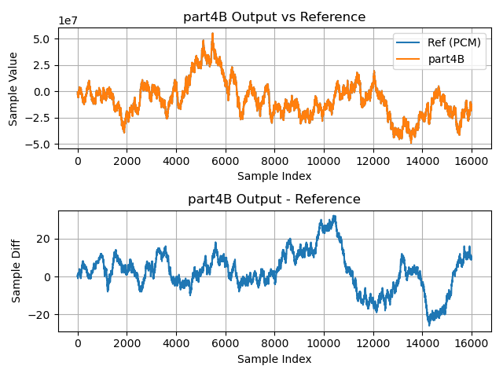

# Part 4B: The `lib_xcore_math` digital filter API

**Part 4B** takes a very different approach than all previous stages. **Part
4B** uses the [digital filter
API](https://github.com/xmos/lib_xcore_math/blob/v2.1.1/lib_xcore_math/api/xmath/filter.h)
provided by `lib_xcore_math`. In this example the FIR filter will be represented
by a `filter_fir_s32_t` object. The digital filter APIs are highly optimized
implementations of 16- and 32-bit FIR filters and 32-bit biquad filters.

The filtering API in `lib_xcore_math` is essentially a fixed-point API, though,
being linear, the actual exponents associated with the input and output samples
are not fixed, only their _relationship_ is. Specifically, it is the
_difference_ between the input and output exponents that is fixed.

## From `lib_xcore_math`

This page references the following types and operations from `lib_xcore_math`:

* [`filter_fir_s32_t`](https://github.com/xmos/lib_xcore_math/blob/v2.1.1/lib_xcore_math/api/xmath/filter.h#L19-L275)
* [`filter_fir_s32_init()`](https://github.com/xmos/lib_xcore_math/blob/v2.1.1/lib_xcore_math/api/xmath/filter.h#L278-L307)
* [`filter_fir_s32()`](https://github.com/xmos/lib_xcore_math/blob/v2.1.1/lib_xcore_math/api/xmath/filter.h#L329-L350)


## Implementation

The implementation for **Part 4B** is divided between 3 functions,
`rx_frame()`, `tx_frame()` and `filter_task()`.

---

```{literalinclude} ../../src/part4B/part4B.c
---
language: C
start-after: +rx_frame
end-before: -rx_frame
---
```

This is nearly identical to the `tx_frame()` found in **Part 2**. The only
difference is that the newly received input samples are placed into `buff[]` in
order, instead of reverse order. We'll see this is because the `filter_s32_t`
object representing the filter handles its own state internally -- we don't need
to account for the ordering of samples ourselves.


---

```{literalinclude} ../../src/part4B/part4B.c
---
language: C
start-after: +tx_frame
end-before: -tx_frame
---
```

This is identical to the `tx_frame()` found in **Part 2**.


---

```{literalinclude} ../../src/part4B/part4B.c
---
language: C
start-after: +filter_task
end-before: -filter_task
---
```

There are a couple things to notice before `filter_task()` gets to its loop.

First, we `sample_buffer[]`, where we store input _and_ output samples, is only
`FRAME_SIZE` elements, instead of `HISTORY_SIZE`. That is because the filter
stores the sample history itself.

Next, we now have a `filter_fir_s32_t` object called `fir_filter`.
`filter_fir_s32_t` is defined in `lib_xcore_math` and represents our 32-bit
digital FIR filter. It must be initialized before it can be used.

Initialization of the filter is accomplished with a call to
`filter_fir_s32_init()`:


> ```c
> C_API
> void filter_fir_s32_init(
>     filter_fir_s32_t* filter,
>     int32_t* sample_buffer,
>     const unsigned tap_count,
>     const int32_t* coefficients,
>     const right_shift_t shift);
> ```

This requires pointers to the filter object itself, the coefficient array, and a
buffer that the filter can use for maintaining the filter state. The filter
coefficients we provide are the `Q2.30` coefficients from
`filter_coef_q2_30.c`, and we declared `sample_buffer[]` to serve as the
state buffer.

The parameter `tap_count` is the number of filter taps, and the final parameter
`shift` is an arithmetic right-shift that is applied to the accumulator to
produce a 32-bit output sample.

What output shift value should be used for the filter?  Here we follow the same
logic as in [**Part 2**](part2.md).

$$
\begin{aligned}
  \mathtt{input\_exp} &= \mathtt{output\_exp} = -31 \\
  \mathtt{acc\_exp} &= \mathtt{input\_exp} + \mathtt{coef\_exp} + \mathtt{vpu\_shr} \\
  \mathtt{output\_exp} &= \mathtt{acc\_exp} + \mathtt{acc\_shr} \\
  \\
  \mathtt{acc\_shr} &= \mathtt{output\_exp} - \mathtt{acc\_exp} \\
    &= -31 - (\mathtt{input\_exp} + \mathtt{coef\_exp} + \mathtt{vpu\_shr}) \\
    &= -31 - (-31 + -30 + 30) \\
    &= 0
\end{aligned}
$$

Here, because `input_exp = output_exp` and `coef_exp = -vpu_shr`, the exponents
and shifts all cancel out.

The inside of `filter_task()`'s loop is much like it was in **Part 2A** with two
key differences. First, there is no call at the end to `memmove()` to shift the
sample history. Not only does the `filter_fir_s32_t` object handle the filter
state for us, it also internally uses a circular buffer to store samples, so no
shift is ever required.

```{note} 
Of course, we could have been using a circular buffer for our sample history in
all the previous stages. This would have avoided the expense of shifting
`TAP_COUNT` samples at the end of every loop iteration, but it also noticeably
complicates the actual filter implementation, which is why we avoided it.
```


The other difference is that `filter_fir_s32()` is called inside the `for` loop,
instead of `filter_sample()`.


> ```c
> C_API
> int32_t filter_fir_s32(
>     filter_fir_s32_t* filter,
>     const int32_t new_sample);
> ```

`filter_fir_s32()` is the function which actually performs the filtering for us.
It takes a pointer to the filter object and the newest input sample value, and
returns the next output sample. We call this with out new input samples in order
and we get out our output samples.

## Results

### Timing

| Timing Type       | Measured Timing
|-------------------|-----------------------
| Per Filter Tap    | 4.73 ns
| Per Output Sample | 4845.99 ns
| Per Frame         | 1294021.62 ns

### Output Waveform

