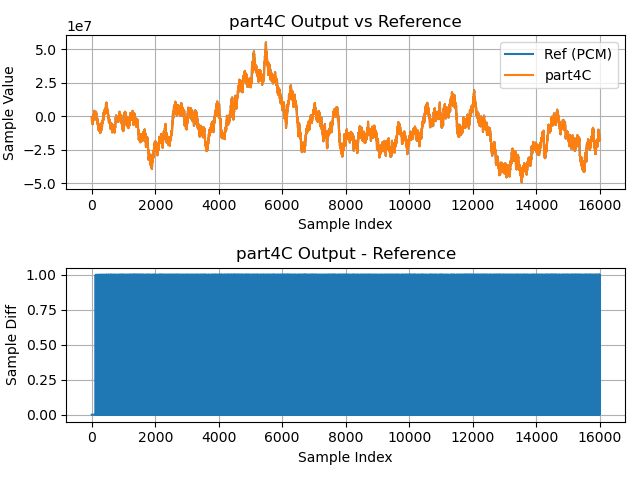

# Part 4C

In [**Part 4B**](part4B.md), `lib_xcore_math`'s digital filter API was used to
implement the FIR filter. **Part 4C** also makes use of the FIR filter API, but
indirectly.

In addition to the digital filter API, `lib_xcore_math` also provides a set of
Python scripts for converting existing digital filters (with floating-point
coefficients) into a form compatible with xcore, and even generates code which
can be directly compiled into the application.

Specifically, for this example the script `gen_fir_filter_s32.py` was used, with
`coef.csv` as input, to generate `userFilter.c` and `userFilter.h`. The script
generates a named filter, where the function names in the generated API are
based on the filter name. In this example, the filter name (specified when
calling the script) is "userFilter".

The filters generated with these scripts allocate and manage their own memory,
resulting in very simple API calls.

### From `lib_xcore_math`

This stage does not directly call any functions from `lib_xcore_math`, but does
make use of the
[`gen_fir_filter_s32.py`](https://github.com/xmos/lib_xcore_math/blob/v2.1.1/lib_xcore_math/script/gen_fir_filter_s32.py)
filter conversion script.

## Generating Filters

The `userFilter.c` and `userFilter.h` used in this stage were provided with this
tutorial as a convenience. You can generate these files yourself using `gen_fir_filter_s32.py`. This will require Python 3 with numpy.

```sh
$ python gen_fir_filter_s32.py -h
usage: gen_fir_filter_s32.py [-h] [--taps TAPS] [--out-dir OUT_DIR] [--input-headroom INPUT_HEADROOM] [--output-headroom OUTPUT_HEADROOM]
                             filter_name filter_coefficients
```

The script requires 2 arguments: the name of the filter, `filter_name`, and a
path to a `.csv` file containing the filter coefficients. The filter
coefficients must be floating-point values with the coefficients separated by
commas and/or whitespace. The coefficient order is `b[0]`, `b[1]`, `b[2]`, etc.

To generate the filter, starting from your workspace root:

```sh
cd xmath_walkthrough/src/stage11
python ../../lib_xcore_math/lib_xcore_math/script/gen_fir_filter_s32.py --taps 1024 userFilter coef.csv
```

The output should be similar to the following:

```sh
workspace\xmath_walkthrough\src\stage11$ python ..\..\lib_xcore_math\lib_xcore_math\script\gen_fir_filter_s32.py --taps 1024 userFilter coef.csv
Filter tap count: 1024
Files to be written:
  .\userFilter.h
  .\userFilter.c
```

The `--taps` option is used to ensure that the converted filter has the expected
number of filter taps.


## Implementation

The `rx_frame()` and `tx_frame()` in **Part 4C** are the same as those in
**Part 4B**. **Part 4C** also includes two additional files, `userFilter.h`
and `userFilter.c` which were generated by the filter conversion script. These
files are intended to be opaque, but are simple, so feel free to take a look.

---

```{literalinclude} ../../src/part4C/part4C.c
---
language: C
start-after: +filter_task
end-before: -filter_task
---
```

We can see that this is just a simpler version of `filter_task()` from **Stage
10**. Here, instead of manually declaring state for and explicitly initializing
a `filter_fir_s32_t` object, we just call the generated function
`userFilter_init()` (from `userFilter.h`) to initialize everything for us. Then,
instead of calling `filter_fir_s32()` to get a new output sample, we just call
`userFilter()` with our new input sample.


## Results

### Timing

| Timing Type       | Measured Timing
|-------------------|-----------------------
| Per Filter Tap    | 4.81 ns 
| Per Output Sample | 4920.95 ns
| Per Frame         | 1311088.12 ns

### Output Waveform


