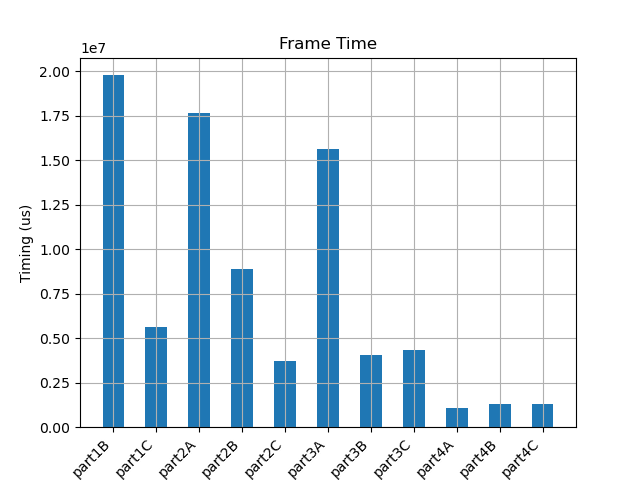

# Performance Info

The following table gives the measured timing from each stage. If you've run the
applications yourself, your mileage may vary based on the compiler version used.

**Frame Time** in the table below is the average time taken by `filter_task()`
in each stage to process a whole frame. This information omits the time taken to
actually transfer samples between tiles, and in some cases the conversion logic
just after receiving or before sending each sample.

**Sample Time** in the table below is the average time taken to produce each
output sample.

**Tap Time** in the table below is the time taken per filter tap -- it is
**Sample Time** divided by 1024, the number of filter taps.


```{note}
The **Part 4A** Sample Time and Tap Time have been divided by 4 in the
following. The parallel implementation of **Part 4A** meant that the measured
sample times were actually for 4 output samples instead of 1.
```

| Stage   | Frame Time    | Sample Time   | Tap Time
|---------|---------------|---------------|--------------
| Part 1A | 647432.896 us |   2528.725 us |   2469.460 ns
| Part 1B |  19778.492 us |     77.000 us |     75.200 ns
| Part 1C |   5608.909 us |     21.642 us |     21.130 ns
| Part 2A |  17626.584 us |     68.594 us |     66.990 ns
| Part 2B |   8881.434 us |     34.425 us |     33.620 ns
| Part 2C |   3720.900 us |     14.275 us |     13.940 ns
| Part 3A |  15604.809 us |     60.236 us |     58.820 ns
| Part 3B |   4054.082 us |     15.499 us |     15.140 ns
| Part 3C |   4312.690 us |     16.516 us |     16.130 ns
| Part 4A |   1101.584 us |      4.119 us |      4.022 ns
| Part 4B |   1294.022 us |      4.846 us |      4.730 ns
| Part 4C |   1311.088 us |      4.921 us |      4.810 ns


The following bar charts show the timing info for each stage, except **Part 1A**
(because it would obscure the rest of the stages otherwise).

### Frame Times 



### Sample Times


### Tap Times

