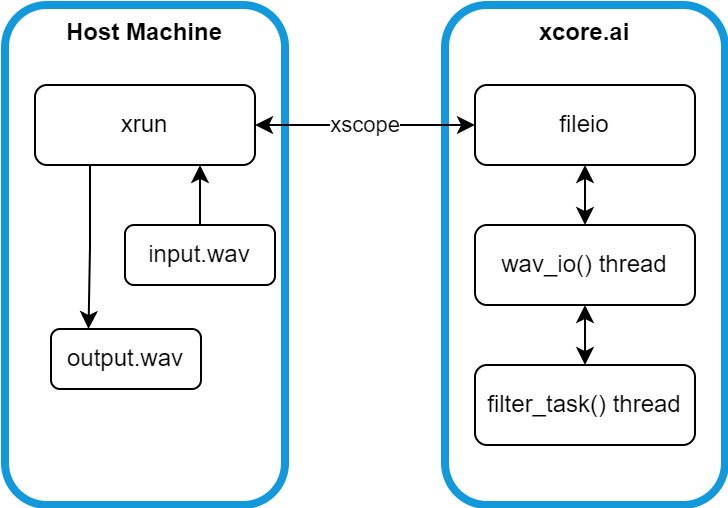

# Software Organization

Each of the firmwares built in this tutorial are variations of the same basic
application. The application runs on an xcore Explorer board, reads a `wav`
file in from the host machine, processes the `wav` file audio through a digital
FIR filter, and writes out the processed audio to a new `wav` file on the host
machine.

## Repositories

There are three Git repositories associated with this tutorial.

The [`xmath_walkthrough`](https://github.com/xmos/xmath_walkthrough/tree/v1.0)
repository has the content of the tutorial (both documentation and application
logic) and defines the workspace layout (through
[`west.yml`](https://github.com/xmos/xmath_walkthrough/tree/v1.0/west.yml)).

The
[`lib_xcore_math`](https://github.com/xmos/lib_xcore_math/tree/v2.1.1/lib_xcore_math)
repository is a library of optimized functions for fast arithmetic on xcore XS3.
Much of this tutorial is about demonstrating how pieces of this library are
used.

The [`xmos_cmake_toolchain`](https://github.com/xmos/xmos_cmake_toolchain)
repository contains boilerplate `.cmake` files which tell CMake how to use the
xcore toolchain.

The `xmath_walkthrough` and `xmos_cmake_toolchain` repositories are cloned into
the root of the tutorial workspace. The `lib_xcore_math` repository is cloned
into `xmath_walkthrough` (this simplifies the CMake project).

## Libraries

Only one external library is used in this tutorial, `lib_xcore_math`

The `lib_xcore_math` library contains lots of functions meant to accelerate
arithmetic on xcore.ai. xcore.ai devices use the XMOS XS3 architecture, which
introduces the XMOS proprietary Vector Processing Unit (VPU). The VPU is a
dedicated piece of hardware on xcore providing SIMD-type parallelism of data
manipulation. 

The library contains many low-level functions for very quickly processing
vectors of data (primarily 16- and 32-bit) in various ways -- its [vector
API](https://github.com/xmos/lib_xcore_math/tree/v2.1.1/lib_xcore_math/api/xmath/vect).
The VPU is very fast, but it implements only integer arithmetic. To that end,
the library also provides a block floating-point [(BFP)
API](https://github.com/xmos/lib_xcore_math/tree/v2.1.1/lib_xcore_math/api/xmath/bfp)
which allows the VPU to be used for fixed-precision (rather than fixed-range)
arithmetic.

`lib_xcore_math` also has APIs for [Fast Fourier
Transforms](https://github.com/xmos/lib_xcore_math/blob/v2.1.1/lib_xcore_math/api/xmath/fft.h),
[linear digial
filters](https://github.com/xmos/lib_xcore_math/blob/v2.1.1/lib_xcore_math/api/xmath/filter.h)
and a small [scalar arithmetic
API](https://github.com/xmos/lib_xcore_math/tree/v2.1.1/lib_xcore_math/api/xmath/scalar).

The purpose this tutorial is not to demonstrate everything available in
`lib_xcore_math`. Rather, it is meant to demonstrate how floating-point
algorithms can be implemented and optimized on xcore.ai, and to help the user
understand the arithmetic logic involved in the optimizations. So, ultimately
this tutorial will only present a small fraction of the APIs provided by
`lib_xcore_math`, focused on the particular case of a digital FIR filter.

## CMake Project

A CMake project is used in this tutorial to build the xcore.ai device firmware. 

To simplify the coordination of the various components (scripts, data, build
artifacts, application output), this tutorial requires that the CMake build
directory for the CMake project sit in the tutorial workspace's root.

The following sections briefly describe the CMake project's structure. For
instructions on configuring the CMake project and building the binaries for this
tutorial, see [Building](building.md).

The CMake source directory for the xcore.ai firmware is the root of the cloned
`xmath_walkthrough` repository. 

It defines an executable target for each stage of this tutorial. These are
called `part1A`, `part1B`, ..., `part4C`. The `lib_xcore_math` library is also
added to the CMake project, as the application firmware will depend on this.

## Applications

The firmware run on the xcore.ai device is a relatively simple application
which, in broad strokes, does the following:

Tile 0 (`wav_io_task`):
1. Opens and reads in the (entire) `input.wav` file from the host.
2. Uses an xcore channel to transfer one frame of input audio to Tile 1.
3. Waits for a frame of processed audio to be transferred back from Tile 1.
4. Repeats steps 2 and 3 until all input audio has been processed.
5. Retrieve some simple performance info from a second thread on Tile 1 (also
   using an xcore channel).
6. Writes out the processed audio to a output `wav` file on the host.
7. Exits.

Tile 1 (`filter_task`):
1. Waits for a frame of input audio to be transferred from Tile 0.
2. Applies the stage's filter logic to the input audio, filling a frame with
   filtered output samples.
3. Uses an xcore channel to transfer the frame of processed audio to Tile 0.
4. Repeats steps 1 through 3 indefinitely.

Tile 1 (`timer_report_task`):
1. Waits for `wav_io_task` to engage it in a simple back and forth handshake.
2. Reports its collected timing info to Tile 1 using a channel.

The application is a two-tile application with the following threads running
(except [**Part 4A**](part4A.md)).

| Tile      | Entry Point           | Description |
|-----------|-----------------------|-------------|
| `tile[0]` |`wav_io_task()`| Handles `wav` file decoding and framing.
| `tile[1]` |`filter_task()`| Filters input audio to produce output.
| `tile[1]` |`timer_report_task()`| Reports performance info back to `tile[0]`.

> Note: Where necessary, this tutorial refers to the threads running on the
> device by the name of the thread entry point as a shorthand. It should be clear
> from context when referring to the entry point function vs the hardware thread
> itself.

This tutorial does not explain the implementation of the `wav_io_task` and
`timer_report_task` threads. Instead, it focuses on the behavior and
implementation of only `filter_task()`. The behavior of the other threads can be
easily discerned by inspecting the code.

