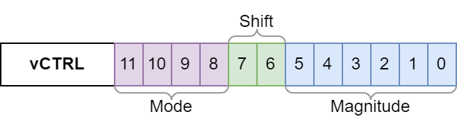
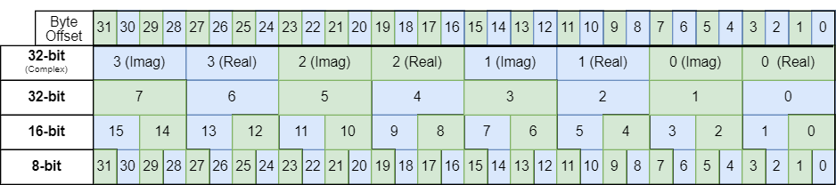
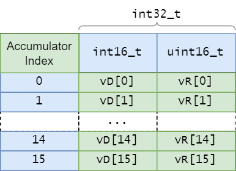

# xcore.ai VPU

xcore.ai has a Vector Processing Unit (VPU). This is a dedicated bit of hardware
meant for accelerating DSP and other math operations by enabling the application
to do more work with each instruction.

All instructions in the XS3 ISA which target the VPU are single-thread-cycle
instructions.

The majority of what follows provides fairly low-level details about the
behavior of the xcore.ai VPU. It is intended to give users enough of a
background to have a sense of the _kinds of operations_ for which the VPU is
well-suited. 

```{eval-rst}
If you are primarily interested in how these details impact you as
a user of ``lib_xcore_math``, feel free to :ref:`skip ahead<skip_ahead>`.
```

## VPU Registers

The VPU has 4 associated registers called `vR`, `vD`, `vC` and `vCTRL`.

```{note}
Each hardware thread (8 per tile on xcore.ai) has its _own set of vector
registers_. Each thread can use the VPU independently and without contension or
interference between the hardware threads.
```

### `vCTRL`

`vCTRL` is a 12-bit register with the following contents:



The `Mode` field controls how the contents of the vector registers are
interpreted during instruction execution. Valid modes are 32-bit
(`VSETCTRL_TYPE_INT32`), 16-bit (`VSETCTRL_TYPE_INT16`) and 8-bit
(`VSETCTRL_TYPE_INT8`). Certain instructions are only available in 32-bit mode.

Primarily the `Mode` determines the bit-depth of the arithmetic to be used. For
example, the `VLMUL` instruction will use the mode bit to determine whether 8-,
16- or 32-bit multiplication is to be applied. It will also determine the
saturation bounds used for saturating instructions.

The `Mode` also determines how headroom information is recorded in the
`Magnitude` field.

The `Shift` field controls the shifting behavior used by several instructions
(`VLADSB`, `VFTFB`, `VFTFF`, `VFTTB`, `VFTTF`). Specifically, it allows the
result of these operations to be shifted one bit right or left (or not shifted).
This is particularly useful for efficiently managing headroom while performing
FFTs.

The `Magnitude` field holds a representation of the headroom of a vector. When
the contents of a vector register are stored in memory using the `VSTR`, `VSTD`
or `VSTC` instructions (but _not_ `VSTRPV`) this field is updated to reflect the
size of the underlying integer. The value retrieved from this field is the
number of bits required to store the largest-magnitude integer saved to memory.

### Vector Registers

There are three vector registers, `vR`, `vD` and `vC`. Each of these registers
is 32 bytes wide, and serves a specific purpose depending upon the VPU
instruction used.

The interpretation of the contents of the vector registers depends upon the
configured VPU mode and the instruction being used.




For most VPU instructions, in 32-bit mode the vector register' contents will be
interpreted as 8 `int32_t` values. In 16-bit mode, 16 `int16_t` values. And in
8-bit mode, 32 `int32_t` values. For example, the `VLADD`, `VLMUL` and `VLASHR`
instructions interpret the contents this way.

Several instructions in 32-bit mode interpret the contents of the vector
registers as 4 complex values, each with a 32-bit real and 32-bit imaginary
part. For example, the `VCMR`, `VCMI` and `VFTFF` instructions do this.

It is conceptually useful to think of the vector registers as being modeled on
the following, where which field type is used depends on the VPU mode.

```c
union {
  complex_s32_t c32[4];
  int32_t s32[8];
  int16_t s16[16];
  int8_t s8[32];
} vector_register_t;

vector_register_t vR, vD, vC;
```

```{note}
The `vector_register_t` union type is not actually defined anywhere. This is a 
model for conceptual purposes only.
```

Additionally, several VPU instructions (`VLMACC`, `VLMACCR`, `VLSUB`) treat the
_pair_ of vector registers `vD` and `vR` as _accumulators_ with higher bit-depth
than the configured mode.

### Accumulators

The accumulation instructions mentioned above treat `vD` and `vR` are treated as
a single logical register, often written as `vD:vR`. In this case, the element
from `vD` is concatenated bit-wise with the corresponding element from `vR`
(with `vD` occupying the most significant bits) to form the accumulator element.

#### 8- and 16-bit Modes

In 8- and 16-bit modes, there are a total of 16 accumulators, each with a
bit-depth of 32 bits. To be clear, in 8-bit mode there are 16 32-bit accumulators available, _not_ 32 16-bit accumulators.

Conceptually, in 8- and 16-bit modes the `vD:vR` vector accumulator data
structure resembles the following (where `vD[k]` and `vR[k]` are each 16 bits
wide):




```{note}
Notice that `vR[k]` in this case can be thought of as an _unsigned_ 16-bit
integer. This is a direct result of the two's complement encoding of signed
integers.

For example, the `int16_t x = -12345` is stored as the bit sequence

    1 1 0 0 1 1 1 1  1 1 0 0 0 1 1 1  = -12345 = x

That sequence is the direct sum

      1 1 0 0 1 1 1 1  0 0 0 0 0 0 0 0       -12544  =    ( int16_t) (x & 0xFF00)
    + 0 0 0 0 0 0 0 0  1 1 0 0 0 1 1 1     +    199  =  + (uint16_t) (x & 0x00FF)
      --------------------------------  =    ------       ----------------------- 
      1 1 0 0 1 1 1 1  1 1 0 0 0 1 1 1       -12345  =    ( int16_t) (x & 0xFFFF)

This framing is sometimes useful for solving problems where unsigned results are
desired.
```

#### 32-bit Mode

In 32-bit mode there are 8 accumulators, each with a bit-depth of _40_ bits.
This means the full, exact 64-bit product of multiplying two 32-bit numbers
cannot be represented in the VPU. Like in 8- and 16-bit modes, the accumulators
are stored across `vD` and `vR`. 

Note that while accumulation operations will _saturate_ at 40-bit bounds, a full
_64_ bits will still be used to represent the accumulator. When accumulating in
32-bit mode, the signed 40-bit result is sign-extended up through the most
significant 24 bits of each `vD[k]`.


```{note}
None of the complex 32-bit instructions use `vR` and `vD` as accumulators. The 
component bit-depth of complex operations is always 32 bits.
```

## VPU Operations

Whereas most instructions in the XS3 ISA perform a single, simple operation, the
instructions which target the VPU typically do significantly more complex
operations. A single instruction may do any or _all_ of the following:

* Load a 32-byte vector
* Perform element-wise multiplication
* Apply bit-shifts to vector elements
* Perform element-wise addition
* Apply rounding logic
* Apply saturation logic
* Perform a circular shift of accumulators

Indeed, the `VLMACCR` instruction (which runs in a single thread-cycle) does all
of these things and more.

### Memory Access

There are a handful of VPU instructions which directly load from or write to
main memory. These include instructions to just load vectors from memory (e.g.
`VLDR`, `VLDD`), just write vectors to memory (e.g. `VSTC`, `VSTRPV`), and
instructions which atomically load from memory and operate on the loaded data
(e.g. `VLMUL`, `VLMACCR`).

In _all_ cases, VPU instructions which load from or write to memory require the
base address used to be word (4-byte aligned). This is true in 32-, 16- and
8-bit modes.

```{note}
For this reason, many functions in the
[`lib_xcore_math`](https://www.github.com/xmos/lib_xcore_math) vector and BFP
APIs require that the vectors being acted upon start at word-aligned addresses.
Some API functions require a 8-byte alignment as well (this stricter alignment
requirement results from the use of the `STD` or `LDD` non-VPU instructions). 

When using the `lib_xcore_math` APIs, be sure to check the documentation of each
operation used to ensure the vectors use the correct alignment. The library also
provides convenient macros which can be used when declaring an array to ensure
it has the desired alignment.
```

### Bit-Shifts And Rounding

With the exception of `VLMACC` and `VLMACCR` in 8- and 16-bit modes, all
multiplications performed by the VPU are followed by an unavoidable rounding
arithmetic right-shift implemented in hardware. 

|  Mode  | Right-shift |
|--------|-------------| 
|`N`-bit |  `N-2` bits |
|  8-bit |      6 bits |
| 16-bit |     14 bits | 
| 32-bit |     30 bits |

This effectively means that the `VLMUL` instruction (and all 32-bit multiplies)
are _fixed-point_ multiplications. The `VLMUL` instruction loads a vector of
elements from a specified address in memory, multiplies them element-wise by the
contents of `vR`, and then applies the rounding shift (followed by saturation
logic) and replaces the contents of `vR` with the results.

```{note}
With this fixed-point framing in mind, that means the multiplicative identity 
elements in 8-, 16- and 32-bit modes are `0x40`, `0x4000`, and `0x40000000` 
respectively.

This also means that if `x` is the value of `vR[k]` prior to a `VLMUL`
instruction being issued and `y` is the value of `vR[k]` afterwards, then the 
following relation must always hold:

$$
      -2\mathtt{x} \le \mathtt{y} < 2\mathtt{x}
$$

In other words, the `VLMUL` instruction _cannot_ be used to scale a value by a
factor less than `-2`, and the scale factor is always _strictly less than_ `2`.
This is true for all modes.
```

Rounding logic is applied with the shift. Rounding is away from zero.

Consider the case for 16-bit mode. Because a 14-bit shift is applied to the
product, conceptually that means the initial contents of `vR` _or_ the vector of
values loaded from memory can by thought of as fixed-point values using a
`Q2.14` format. Equivalently, _both_ `vR` _and_ the vector of loaded values can
by thought of as using the `Q9.7` fixed-point format.

Suppose `vR[0]` has an initial value of `0x1234`. If the `VLMUL` instruction is
issued where a vector of values `t[]` is loaded from memory, with `t[0] =
0x22222`, the following will occur (because `VLMUL` operates element-wise, all
elements other than index `0` can be ignored):

```c
    vR[0] = 0x1234
    t[0] = 0x2222 // Loaded from memory

    P = vR[0] * t[0] = 0x026D52E8  // 32-bit product
    Q = P >> 14      = 0x09B5.4BA0 // 14-bit right-shift (notice the radix point)
    R = round(Q)     = 0x09B5      // Rounding logic applied (round down)
    S = sat16(R)     = 0x09B5      // Saturation logic applied (no saturation)
    vR[0] <-- 0x09B5               // Assigned back to vR[0]
```

### Saturation

Most of the VPU operations on xcore.ai apply saturation logic to the output
values. Saturation logic avoids arithmetic overflows by clamping outputs such
that any result greater than the upper saturation bound is clamped to the upper
bound, and any result less than the lower saturation bound is clamped to the
lower bound.

The XS3 VPU also uses _symmetric_ saturation bounds, such that the lower
saturation bound is the negative of the upper saturation bound. This is as
opposed to using the full two's complement range as possible output values. This
leaves one value that cannot be output in each mode.

| Result Depth | Lower Bound    | Upper Bound     | _Cannot Output_   |
|--------------|----------------|-----------------|-------------------|
|      40 bits | `0x7FFFFFFFFF` | `-0x7FFFFFFFFF` | `-0x8000000000`   |
|      32 bits |   `0x7FFFFFFF` |   `-0x7FFFFFFF` |   `-0x80000000`   |
|      16 bits |       `0x7FFF` |       `-0x7FFF` |       `-0x8000`   |
|       8 bits |         `0x7F` |         `-0x7F` |         `-0x80`   |

The rational for applying saturation logic is that it is almost always
preferable to saturate rather than allow integers to overflow. Further, the
rational for using _symmetric_ saturation bounds is that, e.g. the value
`-0x8000` (in 16-bit mode) doesn't always play nicely.

For example, with `int32_t` values, `-0x80000000 = INT32_MIN = -INT32_MIN`. That
is, `INT32_MIN` and `0` are _both_ equal to their own negative, because
`0x80000000 = INT32_MAX + 1` is the actual _encoding_ of `-0x80000000` in two's
complement.

```{note}
Even though the XS3 VPU cannot _output_ the value `-0x80000000` from any of its
arithmetic operations, `-0x80000000` _is_ handled correctly when used as an 
_input_. For example, when a `VLADD` instruction is issued, if `vR[0]` is 
`-0x80000000`, or if one of the elements loaded from memory is `-0x80000000`.
```

The XS3 VPU does _not_ apply saturation logic when loading a vector from memory
into a vector register using `VLDR`, `VLDD` or `VLDC`. Nor is saturation logic
applied ever applied when writing to memory. 

There is, however, sometimes cause to use the `VLASHR` instruction to load
values from memory into `vR`. The `VLASHR` instruction loads a vector from
memory, applies a signed arithmetic right-shift (specified by a register),
_saturates_, and then places the result in `vR`. This instruction saturates
_even if_ the specified shift is `0` bits.

### Headroom Tracking

The Magnitude bits in the VPU's `vCTRL` register are used for detecting the
headroom of vectors. `vCTRL` is updated whenever the `VSTR`, `VSTD` or `VSTC`
instructions are used to write their respective vector register contents to
memory. The VPU checks the number of non-sign bits in each element being
written, along with the current value of the Magnitude bits in `vCTRL`. The
Magnitude bits in `vCTRL` are updated to the _maximum_ of those values.

That process does _not_ occur with the `VSTRPV` instruction.

Using this mechanism, the VPU can be used to determine a vector's headroom by
simply iterating over the vector, loading it into a vector register and storing
it back to memory. Prior to iterating the `VSETC` instruction is used to clear
the Magnitude bits to `0`, and after iterating the `VGETC` instruction is used
to retrieve the Magnitude bits. The headroom of the vector is `31`, `15` or `7`
minus the Magnitude bits, depending upon whether in 32-, 16- or 8-bit mode.

This mechanism also gives the headroom practically for free when performing an
arithmetic operation which outputs a vector. The same process is used, clearing
and retrieving the Magnitude bits before and after the operation.

Occasionally intermediate values must be written to memory during an operation.
Caution should be used here, as using the `VSTR`, `VSTD` or `VSTC` instructions
to write out the intermediates may clobber the Magnitude bits in `vCTRL`. In this case, the `VSTRPV` instruction can usually be used, bypassing the update to `vCTRL`.

```{eval-rst}
.. _skip_ahead:
```

## VPU Logic in `lib_xcore_math`

Most of the concerns related to the detailed VPU behavior are hidden from the
user by `lib_xcore_math`'s various API's. However, depending on the particular
API and functions used, some of these details inevitably bubble up to user's
scope.

### Memory Alignment

Most significant among these concerns is the memory alignment requirement of the
VPU. All VPU loads and stores must be to memory-aligned addresses. This
ultimately means that any vectors allocated by the user (statically or
dynamically) must also satisfy this condition.

```{note}
On XS3 the word size is 32-bits, and so word-alignment is 4-byte alignment. In
other words, any address `x` loaded by the VPU must have zeros in the two least
significant bits, meeting the condition:

    ((x & 0x3) == 0)
```

For 32-bit values this is not ordinarily a problem, as the toolchain already
guarantees that (simple) allocations of `int32_t` scalars and arrays are
word-aligned. Additionally, memory allocated using `malloc()` are guaranteed to
be 8-byte aligned. However, for 8- and 16-bit vectors word-alignment is _not_
normally guaranteed. Further, many API functions will require not just
word-alignment, but double (8-byte) word-alignment.

To help users deal with these requirements, `lib_xcore_math` provides a pair of
macros which can be used to force word- or double word-alignment. These macros
are
[`WORD_ALIGNED`](https://github.com/xmos/lib_xcore_math/blob/v2.1.1/lib_xcore_math/api/xmath/api.h#L33-L36)
and
[`DWORD_ALIGNED`](https://github.com/xmos/lib_xcore_math/blob/v2.1.1/lib_xcore_math/api/xmath/api.h#L38-L41).

The macros are used when declaring a variable, as in:

```c
int32_t DWORD_ALIGNED someValA;
int32_t WORD_ALIGNED  someValB[13];
int8_t  WORD_ALIGNED  someValC[100];
int16_t DWORD_ALIGNED someValD[22];
```

```{warning}
It is strongly recommended that users of the `lib_xcore_math` APIs annotate any
array (including `int32_t`) which will be used as an input to the API (including
those bound to block floating-point vectors) with one of these macros. Users are
also urged to double check the documentation for whether double word-alignment
is required.

When the alignment requirement is _not_ met, an `ET_LOAD_STORE` exception will 
be raised.
```

### Headroom Reporting

When using `lib_xcore_math`'s vector API, particularly when calling the
'prepare' functions, vector headroom is often needed as an input. It is the
responsibility of the caller to keep track of the vector headroom where needed.

To aid the user in this, and to help avoid unnecessary explicit headroom
computation (because it usually comes for free), most of the vector API's
operations (or at least those which output vectors) will return a
[`headroom_t`](https://github.com/xmos/lib_xcore_math/blob/v2.1.1/lib_xcore_math/api/xmath/types.h#L69-L77)
value. This value is the computed headroom of the output vector.

When using the BFP API, vector headroom will (except where otherwise stated) be
tracked by the API.

### Shift Behavior

Finally, when using the vector API, _most_ of the functions which apply
arithmetic logic will require the user to supply one or more _shift_ parameters
of type [`right_shift_t`](https://github.com/xmos/lib_xcore_math/blob/v2.1.1/lib_xcore_math/api/xmath/types.h#L79-L89).

There are several problems which result in the need for these shift parameters:

* Avoiding bit-depth growth when multiplying or accumulating,
* Avoiding arithmetic underflows cause by the VPU's hardware right-shift, and
* Ensuring block floating-point exponents work out correctly.

Ultimately, this is about avoiding overflows while trying to maintain as much
arithmetic precision as possible. 

To help deal with this, most arithmetic operations in the vector API have a
companion function (a "prepare" function) whose name, by convention, is the name
of the operation function with "_prepare" appended. The purpose of the "prepare"
functions is to consume metadata about the operation's input vectors (such as
exponents, headroom and sometimes length) and to return the appropriate output
exponent (to be associated with the operation's output mantissas), and any shift
values required by the operation.

For example,
[`vect_complex_s32_macc()`](https://github.com/xmos/lib_xcore_math/blob/v2.1.1/lib_xcore_math/api/xmath/vect/vect_complex_s32.h#L248-L323)
is an operation which implements a 32-bit complex element-wise
multiply-accumulate.

```c
C_API
headroom_t vect_complex_s32_macc(
    complex_s32_t acc[],
    const complex_s32_t b[],
    const complex_s32_t c[],
    const unsigned length,
    const right_shift_t acc_shr,
    const right_shift_t b_shr,
    const right_shift_t c_shr);
```

`b[]` and `c[]` are input vectors, and `acc[]` is an input/output vector. This
function multiplies together elements of `b[]` and `c[]` and adds the result to
the corresponding element of `acc[]`. To do this is requires _3_ shift
parameters.

`acc_shr`, `b_shr` and `c_shr`, which correspond to `acc[]`, `b[]` and `c[]`
respectively are _input_ shifts. `b_shr` and `c_shr` are signed, arithmetic
right-shifts applied to elements of `b[]` and `c[]` _prior_ to multiplication.
Because a 32-bit multiplication is performed, the VPU also applies a 30-bit
arithmetic right-shift to the product. `acc_shr` is then applied to the element
of `acc[]` prior to being added to the intermediate result.

[`vect_complex_s32_macc_prepare()`](https://github.com/xmos/lib_xcore_math/blob/v2.1.1/lib_xcore_math/api/xmath/vect/vect_complex_s32_prepare.h#L66-L158)
is the corresponding prepare function for `vect_complex_s32_macc()`.

```c
C_API
void vect_complex_s32_macc_prepare(
    exponent_t* new_acc_exp,
    right_shift_t* acc_shr,
    right_shift_t* b_shr,
    right_shift_t* c_shr,
    const exponent_t acc_exp,
    const exponent_t b_exp,
    const exponent_t c_exp,
    const exponent_t acc_hr,
    const headroom_t b_hr,
    const headroom_t c_hr);
```

`vect_complex_s32_macc_prepare()` takes the exponents and headrooms of all three
input vectors and outputs the exponent of the result and the three required
shift parameters.

Users must pay _careful attention_ to how these shift parameters are used in the
functions they call. Sometimes the shifts are applied to _input operands_, and
other times they are applied to intermediate results to produce the _output_.
Additionally, sometimes the operations take _signed_ right-shifts (typical of
_input_ shifts), meaning they can be used to left-shift elements (useful for
avoiding underflow). But sometimes the operations take _unsigned_ shifts
(typical of _output_ shifts).

The vector API should be considered a low-level API for advanced usage. Always
be sure to refer to the documentation to determine exactly how the shift
parameters are used for a given API call.